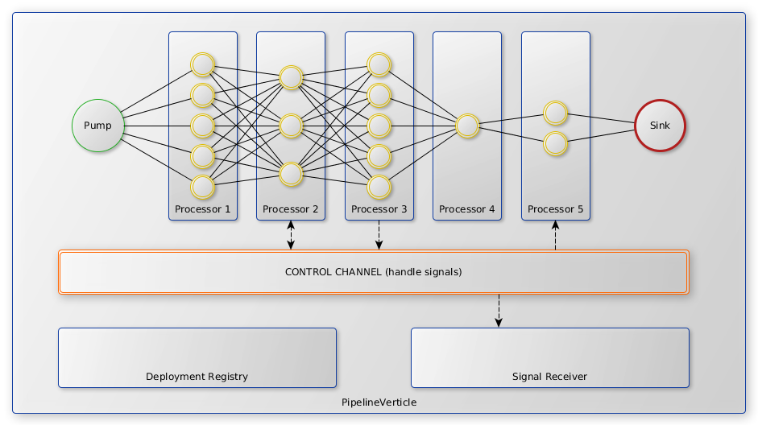

# Vert.x Pipeline

[](https://travis-ci.org/myprysm/vertx-pipeline)

An Event Stream Processing platform, highly scalable, resilient, and asynchronous by design.

## What's Vert.x Pipeline

Vert.x Pipeline looks much like Vert.x, acting as a toolbox, toolkit, low-resource consuming,
fast and non blocking flow processor. It consists in building a set of scalable `pipelines` 
through a configuration descriptor, running the system as a standalone application 
as well as embedding it into your own stuff. Each element of the pipeline is a single `verticle` 
and relies on Vert.x backbone.

A `pipeline` is a set of one `pump`, zero to n `processors`, and one `sink`. 
It is meant to emit events on Vert.x `event bus` from a `pump` to a `sink`. 
Those events can be intercepted by any kind of `processor` configured in the chain 
to perform any action as described below.




For easier data manipulation, this first version (more of a POC at the moment) communicates its events
only through `JsonObject` events. It is planned to support other formats like `Avro`, `Protobuf` or `Thrift`.

Those `verticles` can be configured quickly and easily from a simple `json` or `yaml` file describing
the event source (`pump`), the operations to execute on it (`processor`), and finally the output (`sink`).

It tries to leverage Vert.x with reactive streams (RxJava2) for a better flow control and backpressure capabilities.
Each `verticle` of the `pipeline` is addressed in the chain automatically during deployment 
on the `event bus` and is meant to perform either long/blocking computations or small things 
but also and mainly a **single operation** on an event.
This can come from extracting data to accumulate events before aggregating the results when a termination signal is sent.

Vert.x Pipeline embeds loads of `pump`, `processor`, and `sink` in its core, 
but if those `verticles` are not enough, you can also re-use and augment this toolkit with your own.
This is easy as a pie.

Please check the documentation generated aside to sources to discover all the `verticles` you can put
into your pipelines and their options.

## Configuring pipeline

As explained above even though a `pipeline` has no limit in its internal chain, 
it requires only one input channel (`pump`) and one output channel (`sink`).

Here is an example of a simple pipeline that will pump a timer every 100ms and this will output its data
into a json file:

```
simple-timer-processor:
  pump:
    type: fr.myprysm.pipeline.pump.TimerPump
    interval: 100
    unit: MILLISECONDS
  processors:
    - type: fr.myprysm.pipeline.processor.DataExtractorProcessor
      extract:
        counter: another.field.counter
        timestamp: that.damn.works
    - type: fr.myprysm.pipeline.processor.LogProcessor
      level: INFO
  sink:
    type: fr.myprysm.pipeline.sink.FileSink
    path: /some/path/to/store
    # Extension will be guessed from output type
    file: timer-output
    # JSON is the default output format of this sink
    type: json
```


## Developing new veticles

It is quite easy to develop with Vert.x Pipeline. Using `maven` you just have to
add the following dependency to your `pom.xml`:

```
<dependency>
    <groupId>fr.myprysm</groupId>
    <artifactId>vertx-pipeline-core</artifactId>
    <version>${vertx-pipeline.version}</version>
</dependency>
```

In case you look to extend Vert.x Pipeline you can just package your `jar` without dependencies.
To run your extension as a docker container, `docker-maven-plugin` can be of some help:

```
<plugin>
    <groupId>com.spotify</groupId>
    <artifactId>docker-maven-plugin</artifactId>
    <version>${docker-plugin.version}</version>
    <executions>
        <execution>
            <id>docker</id>
            <phase>package</phase>
            <goals>
                <goal>build</goal>
            </goals>
        </execution>
    </executions>
    <configuration>
        <!-- Configure the image name -->
        <imageName>your/pipeline-image</imageName>
        <baseImage>myprysm/vertx-pipeline-core</baseImage>
        <env>
            <VERTICLE_HOME>/usr/verticles</VERTICLE_HOME>
        </env>
        <workdir>$VERTICLE_HOME</workdir>
        <resources>
            <resource>
                <targetPath>/usr/verticles</targetPath>
                <directory>${project.build.outputDirectory}</directory>
                <includes>
                    <include>config.yml</include>
                </includes>
            </resource>
            <resource>
                <targetPath>/usr/verticles</targetPath>
                <directory>${project.build.directory}</directory>
                <includes>
                    <include>${project.artifactId}-${project.version}.jar</include>
                </includes>
            </resource>
            <!-- don't forget to also add all the dependencies required by your application -->
        </resources>
    </configuration>
</plugin>
```

Don't forget to map volumes if your using some `FileSink`... As this version is under development,
you could expect some strange behaviour. If you consider it a bug please open an issue an we'll
check what we can possibly do.

It is recommended to use Maven `exec` plugin to facilitate the development phase.
With the following configuration you will be able to run `mvn exec:java` to launch your pipelines.

```
<plugin>
    <groupId>org.codehaus.mojo</groupId>
    <artifactId>exec-maven-plugin</artifactId>
    <version>${exec-plugin.version}</version>
    <configuration>
        <mainClass>fr.myprysm.pipeline.Launcher</mainClass>
        <arguments>
            <argument>run</argument>
            <argument>fr.myprysm.pipeline.DeploymentVerticle</argument>
        </arguments>
    </configuration>
</plugin>
```

This configuration will run you pipeline configuration from your `resources/config.yml`.

In case your lazy or you don't want to configure maven plugins, you can also use the Vert.x Pipeline POM
as parent:

```
<parent>
    <artifactId>vertx-pipeline</artifactId>
    <groupId>fr.myprysm</groupId>
    <version>1.0.0-SNAPSHOT</version>
</parent>
```

This allows you to import plugin configuration automatically from the configuration directly used by the core.
It brings the capability to build a `fat-jar` as well as building `Docker` images (like written previously).

Vert.x Pipeline provides an enhanced `ConfigurableVerticle<T extends Options>` as well as 
`BaseJsonPump<T extends ProcessorOptions>`, `BaseJsonProcessor<T extends ProcessorOptions>` 
and `BaseJsonSink<T extends ProcessorOptions>`. They provide a simple lifecycle that is invoked
when a `PipelineVerticle` is (un)deployed across the instance(s). 
It is meant to avoid some boilerplate code while keeping some control and awareness
of what should do the `verticle` to execute fully and be operable inside of a running `pipeline`.

Startup of a `ConfigurableVerticle` occurs as follows:


Shutdown of a `ConfigurableVerticle` occurs as follows:


Each base implementation of a `pump`, `processor`, `sink` comes with some defaults for thoses steps
of the lifecycle but you can obviously override almost everything. It provides a good and quick start
to develop new components/nodes to enhance your network of pipelines. As you can notice this lifecycle
is also quite simple and tries to stick to Vert.x `Verticle`.

More deeper a processor that does nothing else but forwarding the messages as they come looks like:
```
package fr.myprysm.pipeline.processor;

import fr.myprysm.pipeline.validation.ValidationResult;
import io.reactivex.Completable;
import io.reactivex.Single;
import io.vertx.core.json.JsonObject;

/**
 * A processor that does nothing.
 * It emits the items as they come.
 */
public final class NoOpProcessor extends BaseJsonProcessor<ProcessorOptions> {

    @Override
    public Single<JsonObject> transform(JsonObject input) {
        return Single.just(input);
    }

    @Override
    protected Completable startVerticle() {
        return Completable.complete();
    }

    @Override
    public ProcessorOptions readConfiguration(JsonObject config) {
        return new ProcessorOptions(config);
    }

    @Override
    public Completable configure(ProcessorOptions config) {
        return Completable.complete();
    }

    @Override
    public ValidationResult validate(JsonObject config) {
        return ValidationResult.valid();
    }
}
```
You can look into sources to see examples of `sink` and `pump`.

While providing default options for each kind of components each `verticle` should describe
its specific options with validators (using `JsonValidation` and `JsonHelper`)
to ensure a proper run and the pipeline stability.

## In the pipe

- [x] `ForkProcessor`                   - duplicates the signal to another `pipeline` or any other `MessageConsumer`.
                                        ([options](https://github.com/myprysm/vertx-pipeline/blob/develop/vertx-pipeline-core/src/main/asciidoc/dataobjects.adoc#forkprocessoroptions))
- [x] `DataExtractorProcessor`          - extracts and transform input event to a new brand output event.
                                        ([options](https://github.com/myprysm/vertx-pipeline/blob/develop/vertx-pipeline-core/src/main/asciidoc/dataobjects.adoc#mergebasicprocessoroptions))
- [x] `ObjectToArrayProcessor`          - transforms a field into an array. When field is null, array is empty, 
                                        otherwise array contains the previous field value.
                                        ([options](https://github.com/myprysm/vertx-pipeline/blob/develop/vertx-pipeline-core/src/main/asciidoc/dataobjects.adoc#objecttoarrayprocessoroptions))
- [x] `CounterSignalEmitterProcessor`   - Emits a signal to the `PipelineVerticle` controller every n received events 
                                        to either broadcast a flush, or terminate the pipeline.
                                        ([options](https://github.com/myprysm/vertx-pipeline/blob/develop/vertx-pipeline-core/src/main/asciidoc/dataobjects.adoc#countersignalemitterprocessoroptions))
- [x] `TimerSignalEmitterProcessor`     - Emits a signal to the `PipelineVerticle` controller after configured duration
                                        to either broadcast a flush, or terminate the pipeline.
                                        ([options](https://github.com/myprysm/vertx-pipeline/blob/develop/vertx-pipeline-core/src/main/asciidoc/dataobjects.adoc#timersignalemitterprocessoroptions))
- [x] `MergeBasicExtractor`            - Accumulates incoming events and map them to a key.
                                        Provides the ability to merge and sort incoming arrays when the key already
                                        exists. Provides the ability to send the accumulated events sorted (or not)
                                        ([options](https://github.com/myprysm/vertx-pipeline/blob/develop/vertx-pipeline-core/src/main/asciidoc/dataobjects.adoc#mergebasicprocessoroptions))
- [x] `JoltProcessor`                   - Perform complex `JSON` transformations using [JOLT](http://bazaarvoice.github.io/jolt/).
                                        Can be configured either from a file or directly in pipeline configuration. 
                                        ([options](https://github.com/myprysm/vertx-pipeline/blob/develop/vertx-pipeline-core/src/main/asciidoc/dataobjects.adoc#joltprocessoroptions))
- [x] `CronPump`                        - Schedule events with cron expression using [Quartz Scheduler](http://www.quartz-scheduler.org/).
                                        This is useful to schedule recurrent complex processes.
                                        Can be configured either from a file or directly in pipeline configuration. 
                                        ([options](https://github.com/myprysm/vertx-pipeline/blob/develop/vertx-pipeline-core/src/main/asciidoc/dataobjects.adoc#cronpumpoptions))
## Next to come

- [ ] Pipeline pause/resume
- [ ] Pipeline hot redeployment
- [x] Pipeline metrics - know you throughput [Dropwizard implementation](https://github.com/myprysm/vertx-pipeline/tree/develop/vertx-pipeline-dropwizard-metrics)
- [ ] Web interface - check the status, reconfigure
- [ ] More processors...
- [ ] More sinks (database, web, ...)
- [ ] More pumps (database, web, ...)
- [ ] Datasource management [#1](https://github.com/myprysm/vertx-pipeline/issues/1)
